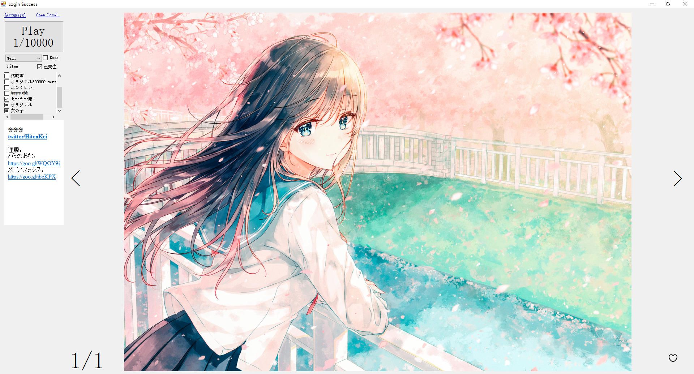
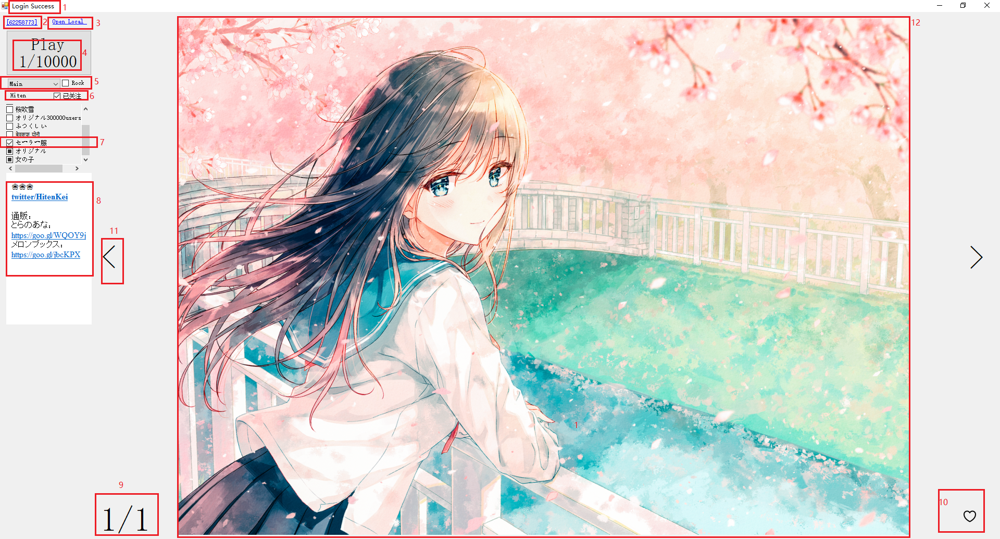

# PixivAss
Pixiv本地助手，用aria2预下载图片到本地，自动标记已读，定时搜索可能感兴趣的图生成浏览队列，本地收藏图片(可分P收藏)和关注。
本质爬虫+图片浏览器，主要是解决pixiv打开图片太慢和没法标记已读的问题。

# 运行前需要
确保使用x64系统(因为x86可用内存不足)

安装VS2017与.Net Framework 4.7.1

在config.json填写用户名和用户id(用于RunInitTask和访问测试,不影响其它功能)

在config.json填写下载目录

在config.json指定的地址(默认为本地1081端口)运行可访问pixiv的代理

在config.json指定的地址(默认本地4321端口)运行mysql server

用create_table.sql初始化msyql数据库

在数据库invalidkeyword表里添加不想看到的tag(非必须)

用premium会员账号登录pixiv(premium会员用于搜索时提供排序权限，不影响其它功能)

在chrome上登录pixiv并运行[pixivHelper](https://github.com/xyzkljl1/PixivHelper)插件(作用是向本地5678端口发送cookie)，或手动把cookie填到数据库的status表中

用VS打开工程，用nuget还原依赖库

# 界面功能

1:访问测试，访问pixiv主页并验证用户名，成功则显示Success

2:图片pid,点击则用默认浏览器打开图片所在页

3:打开本地文件(用系统默认方式)

4:浏览队列中图片总数及当前位置，点击则开始自动播放

5:选择浏览队列，Fav/FavR包含已收藏图片，Main/MainR是根据关键字搜索和关注的作者生成的浏览队列，其它是入列作者浏览队列(包含该作者的作品)；勾选Rock后为随机浏览(会很慢)

6:作者，勾选为关注，不勾选为不关注，中间态为加入浏览队列(但是下次更新时该队列才会完整)

7:tag，勾选为关注，不勾选为不关注，中间态为不关注且置于底部

8:简介

9:当前图(组)的图片总数和当前位置

10:收藏，左键点击在不收藏/收藏(Fav队列)/私有收藏(FavR队列)间切换

   右键点击取消当前P收藏(仅对已收藏且数量大于1的图组有效)，显示为一个X，取消后再次在队列中看到该图组时，不会看到该P，并且左下角会显示未取消收藏的图片数量
   

11:切图，效果同方向键

12:图片，如果图片未下载到本地，会显示本地没图

# 后台功能

每隔一个小时运行，虽然叫后台功能，但是只有程序运行期间才会执行

每小时，处理部分更新队列

每日，获取排行榜、(部分)本地超过一定时间未更新的、(部分)按关键字和收藏数搜索的图片id加入更新队列

每日，下载所有位于浏览队列中且尚未下载的图片到本地

每周，获取已关注/已入列作者的所有图片信息，将已获取的图片排序生成Main/MainR浏览队列

# 其它

设计上是个一直运行的程序，不用时缩小到托盘。

一旦在浏览队列中离开某张图，它就会被标记已读，并且不再出现在今后的Main/MainR队列中

按方向键左右逐张切换图片，按方向键上下键逐组切换图片

收藏和关注数据均存储在本地数据库，不影响pixiv账号的状态。

将DownloadIllusts参数改为false可以下载所有已知图片而非仅下载队列中的图片，但是不建议这么干

在config.json将ShowInitButton改为true显示RunInitTask按钮，点击后从pixiv将收藏的作者和图片并同步到本地。

过于频繁拉取图片可能会收到pixiv的警告信

胡逼写的，仅供参考

# TODO

修复有时切换队列无效的bug

